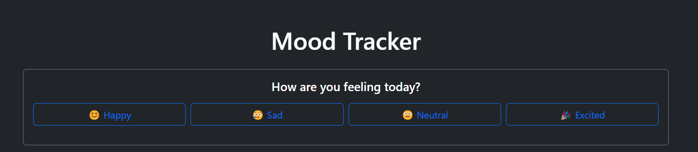
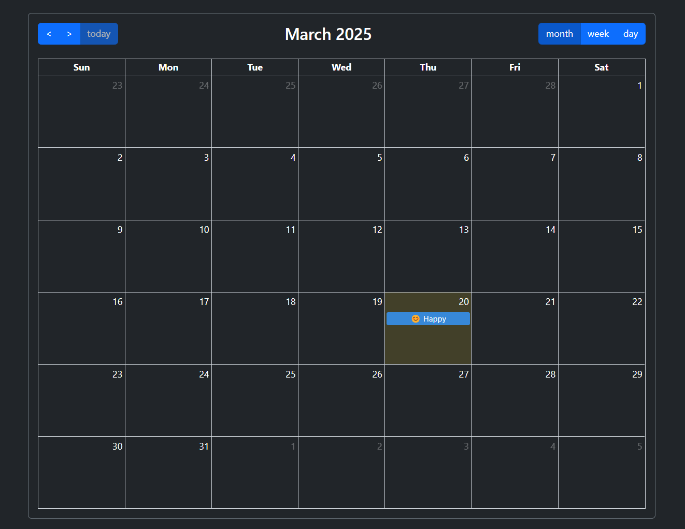
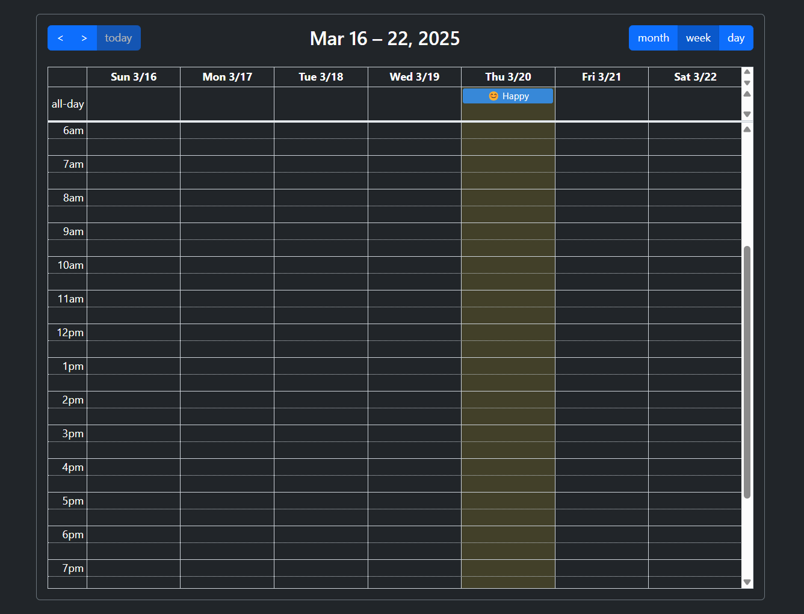
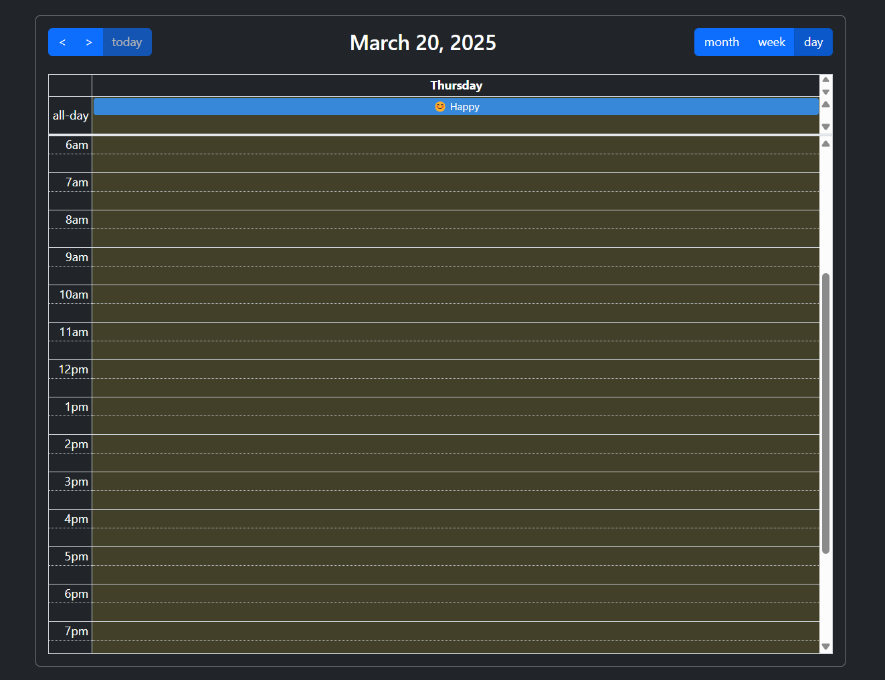

# MoodList

MoodList is a simple and intuitive web application that allows users to track their daily moods using emojis. The app provides a calendar view to visualize mood trends over time, helping users reflect on their emotional well-being.

## Features

- **Mood Tracking**: Select a mood emoji (e.g., 😊, 😢, 😐, 🎉) to represent how you feel each day.
- **Calendar View**: View your mood history in a calendar format with day, week, and month views.
- **LocalStorage Integration**: All mood logs are stored locally in your browser, ensuring privacy and persistence.
- **Responsive Design**: Works seamlessly on both desktop and mobile devices.
- **User-Friendly Interface**: Minimalistic and easy-to-navigate design.

## Screenshots

### Mood Selection


### Calendar View




## Deployment

- **Hosted Application**: [MoodList Deployment](https://moodlist-henna.vercel.app/)
- **GitHub Repository**: [MoodList on GitHub](https://github.com/rejisterjack/moodlist)

## Getting Started

1. Clone the repository:
   ```bash
   git clone https://github.com/rejisterjack/moodlist.git
   ```
2. Navigate to the project directory:
   ```bash
   cd moodlist
   ```
3. Install dependencies:
   ```bash
   npm install
   ```
4. Start the development server:
   ```bash
   npm run dev
   ```
5. Open the application in your browser at `http://localhost:5173`.

## How It Works

1. **Pick a Mood**: Choose an emoji that best represents your mood for the day.
2. **Save Your Mood**: The selected mood is saved in your browser's LocalStorage.
3. **View Your Timeline**: Use the calendar to view your mood history in day, week, or month views.

## Technologies Used

- **HTML5**: For structuring the application.
- **CSS3**: For styling and layout.
- **JavaScript**: For interactivity and logic.
- **FullCalendar.js**: For the calendar view.
- **Bootstrap 5**: For responsive design and UI components.

## License

This project is licensed under the MIT License.

